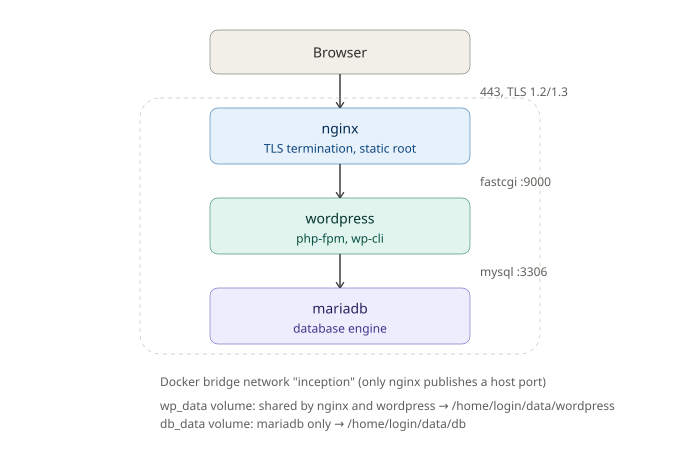

*This project has been created as part of the 42 curriculum by kaahmed.*

# Inception

## Description

Inception is a containerized infrastructure built with Docker Compose. The goal is to deploy a WordPress stack made of three isolated services: NGINX, WordPress with PHP-FPM, and MariaDB.

The stack is designed to follow the project rules closely: each service runs in its own container, images are built from custom Dockerfiles, the website is exposed only through NGINX on port 443, and persistent data is stored in Docker named volumes. Secrets are separated from environment variables so confidential values do not need to live inside the application configuration.



## Project Description

This project uses Docker to package the stack and its runtime dependencies. The repository includes:

- `Makefile` for building, starting, stopping, and cleaning the stack.
- `srcs/docker-compose.yaml` for service orchestration, networks, secrets, and volumes.
- `srcs/.env` for non-sensitive configuration values such as the username and domain.
- `srcs/requirements/nginx/` for the TLS-enabled reverse proxy.
- `srcs/requirements/wordpress/` for WordPress, PHP-FPM, and WP-CLI setup.
- `srcs/requirements/mariadb/` for the database service and initialization scripts.
- `secrets/` for locally stored sensitive values used by Docker secrets.

Main design choices:

- NGINX is the only public entrypoint and terminates TLS with TLSv1.2/TLSv1.3.
- WordPress runs without NGINX in the PHP-FPM container.
- MariaDB runs as a dedicated database container.
- Data persists in Docker named volumes backed by host directories.
- Runtime configuration uses environment variables, while passwords are read from secrets.

Docker is used because it provides isolated, reproducible services with a clear separation of concerns. Compared with a virtual machine, Docker is lighter, faster to start, and easier to rebuild consistently for a small multi-service project like this one.

### Virtual Machines vs Docker

- Virtual machines emulate a full operating system and are heavier in memory and startup time.
- Docker shares the host kernel and isolates only the application environment, which makes it more efficient for this stack.
- For this project, Docker is a better fit because the requirement is service isolation, not a full desktop or kernel-level VM.

### Secrets vs Environment Variables

- Environment variables are used for non-sensitive values such as the domain name, username, database name, and WordPress metadata.
- Secrets are used for passwords and credentials so they do not appear in normal configuration files or command output.
- This separation keeps the configuration readable while reducing the risk of exposing confidential data.

### Docker Network vs Host Network

- A dedicated Docker bridge network is used so the containers can communicate by service name.
- Host networking would expose services directly on the host stack and reduce isolation.
- The bridge network matches the project requirement and keeps the stack self-contained.

### Docker Volumes vs Bind Mounts

- Docker named volumes are used for the database and WordPress data so the content survives container recreation.
- Bind mounts are avoided for the persistent stack data because the project requires named volumes.
- The host directories behind the volumes are created under the user home directory so the data remains easy to inspect and manage locally.

## Instructions

Requirements:

- Docker and Docker Compose must be installed.
- The local username and domain values must be defined in `srcs/.env`.
- The secret files in `secrets/` must exist before the stack is started.

Build and launch:

```bash
make
```

Useful commands:

```bash
make create_dirs
make up
make down
make down-v
make fclean
make re
make status
make logs
```

The website is available at:

```text
https://<login>.42.fr
```

## Resources

### Containerization & Orchestration

- [Docker Documentation](https://docs.docker.com/)
- [Docker Networking Guide](https://docs.docker.com/network/)
- [Docker Storage Guide](https://docs.docker.com/storage/)
- [Docker Compose Documentation](https://docs.docker.com/compose/)

### Web Server & Backend Stack

- [Nginx Documentation](https://nginx.org/en/docs/)
- [Nginx Tutorial - Nana](https://www.youtube.com/watch?v=q8OleYuqntY)
- [PHP-FPM Documentation](https://www.php.net/manual/en/install.fpm.php)
- [MariaDB Documentation](https://mariadb.com/kb/en/)
- [PHP-FPM with Nginx (FastCGI setup tutorial)](https://www.digitalocean.com/community/tutorials/understanding-and-implementing-fastcgi-proxying-in-nginx)

### CMS & CLI Tools

- [WordPress CLI Documentation](https://wp-cli.org/)
- [WP-CLI Handbook](https://make.wordpress.org/cli/handbook/)

### Security & Cryptography

- [OpenSSL Documentation](https://www.openssl.org/docs/)
- [What is SSL](https://www.cloudflare.com/learning/ssl/what-is-ssl/)
- [What is TLS](https://www.cloudflare.com/learning/ssl/transport-layer-security-tls/)

## AI usage:

Copilot (GitHub Copilot in VS Code) was used throughout the project as a learning and debugging assistant, not as a code generator for the core logic. Specific uses included:

- Debugging the shell entrypoint scripts (`mariadb/tools/entrypoint.sh`, `wordpress/tools/entrypoint.sh`, `nginx/tools/entrypoint.sh`) — particularly getting the MariaDB first-run initialization sequence right and diagnosing why WordPress couldn't reach MariaDB before the wait-loop was added.
- Understanding how NGINX's `fastcgi_pass` and PHP-FPM's `listen` directive need to line up for the reverse proxy to work between containers.
- Clarifying WP-CLI command syntax (`wp core install`, `wp user create`) when setting up WordPress non-interactively.
- Reviewing Dockerfile and `docker-compose.yaml` syntax for mistakes (e.g. secret mounting, volume driver options).
